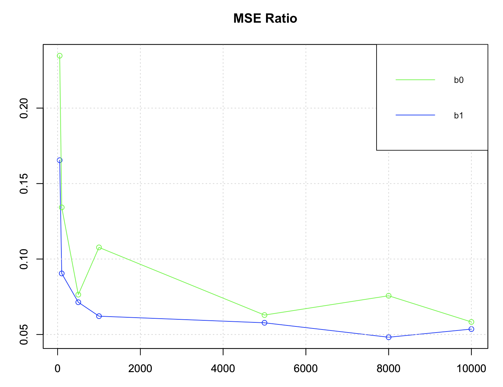

```
---
title: "RDPG_ME_size"
output:
  md_document:
    variant: markdown_github
---
```

```{r setup, include=FALSE}
knitr::opts_chunk$set(echo = TRUE)
```




##Real RDPG: 
red: naive regression coefficient estimate
green: adjusted regression coefficient estimate
blue: true regression coefficient estimate
  
##b0:


##b1:
  

##MSE Ratio:


##delta_bias:


##delta_variance:


##mean(|Xhat1 - X1|):


