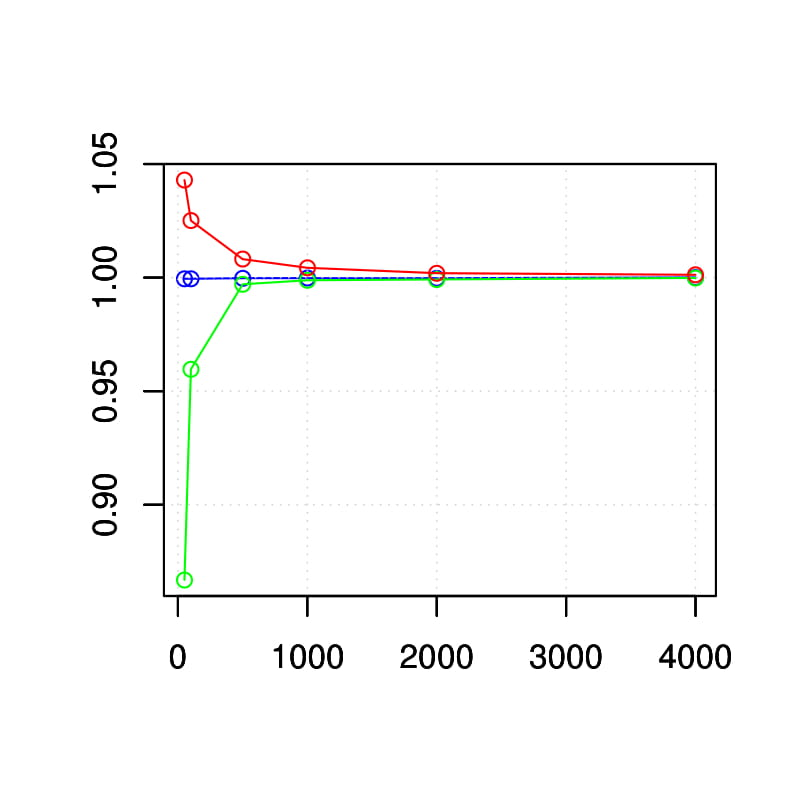
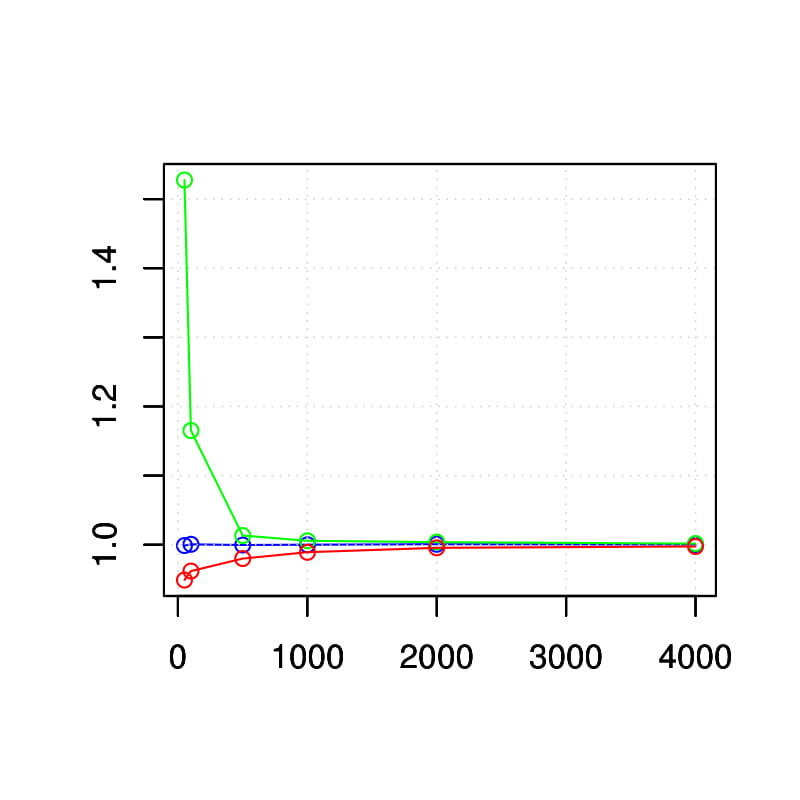
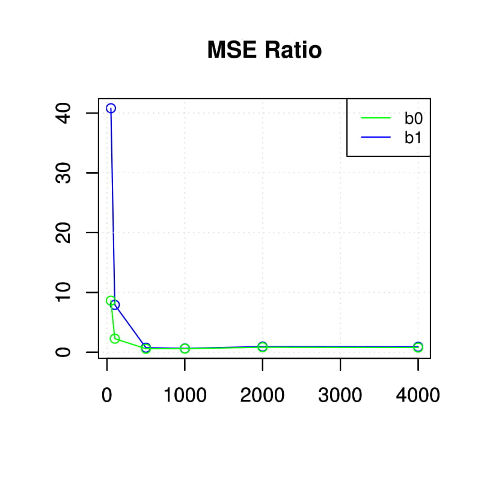
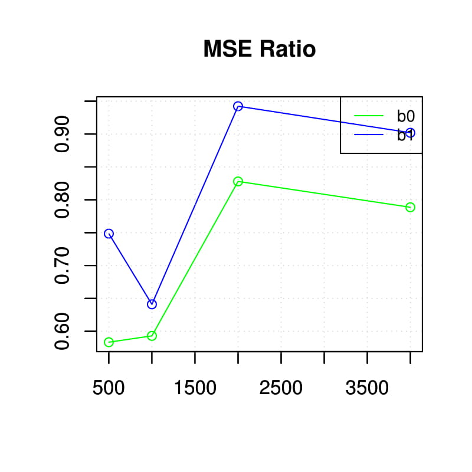
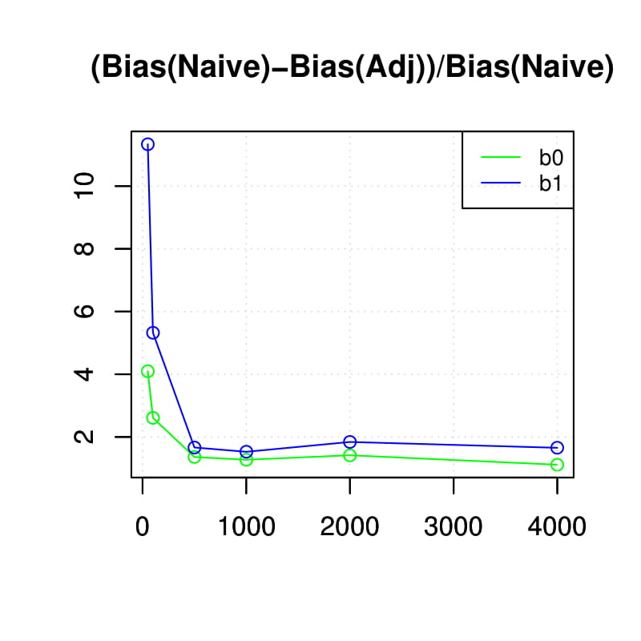
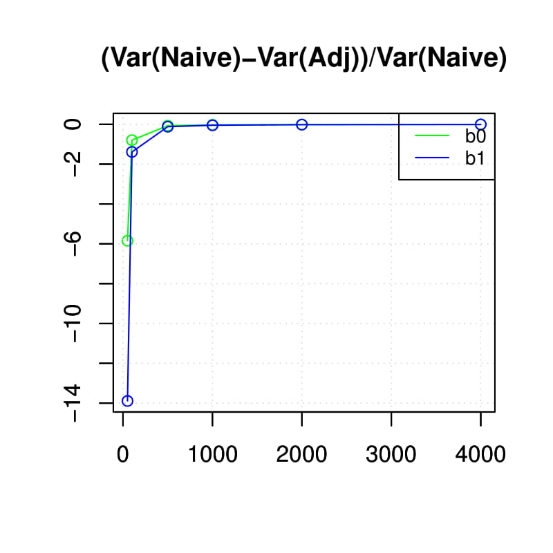
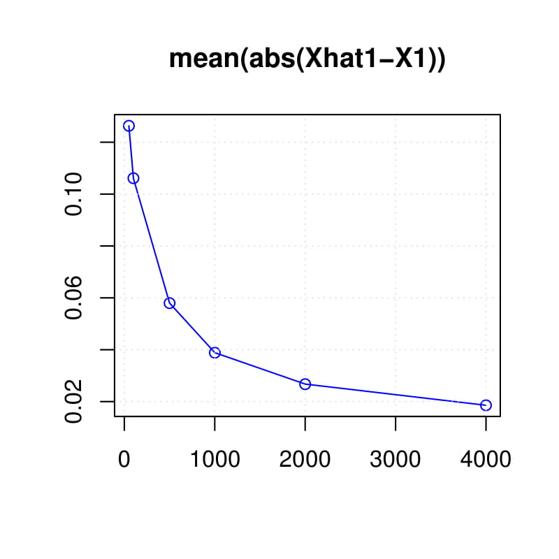

```
---
title: "RDPG_ME_size"
output:
  md_document:
    variant: markdown_github
---
```

```{r setup, include=FALSE}
knitr::opts_chunk$set(echo = TRUE)
```


Real RDPG - 100 mc runs
red: naive regression coefficient estimate
green: adjusted regression coefficient estimate
blue: true regression coefficient estimate
  
b0:


b1:
  

MSE Ratio:



delta_bias:


delta_variance:


mean(|Xhat1 - X1|):



